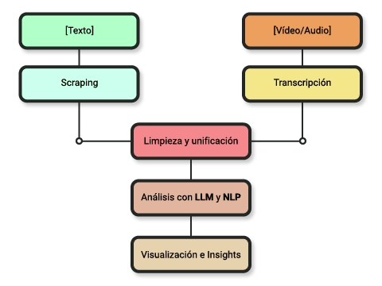
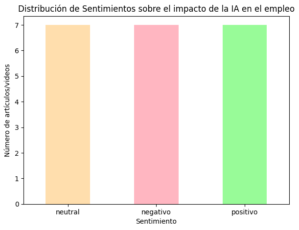
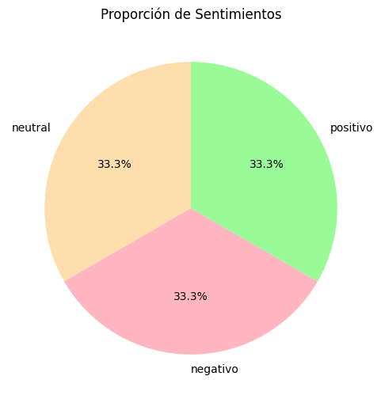
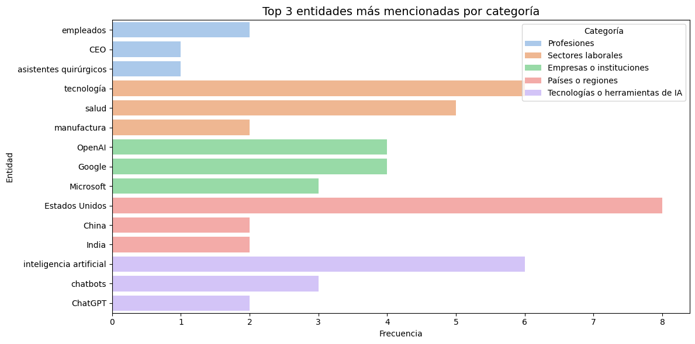
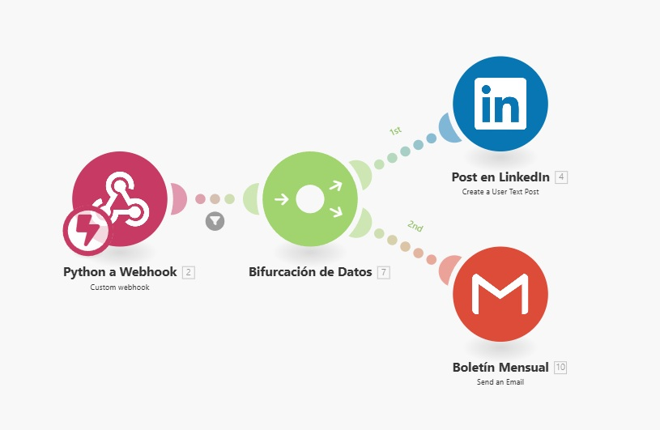
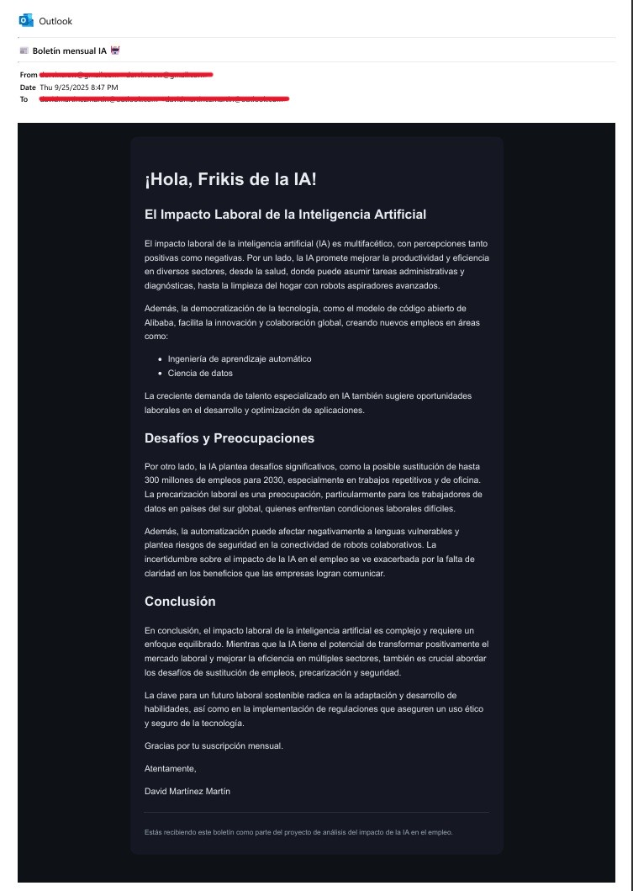

# Proyecto TFM 1: Resumen Multimodal sobre el Impacto de la IA en el Empleo

  

## Introducción
La **inteligencia artificial (IA)** está transformando aceleradamente el mercado laboral, modificando modelos de negocio, procesos de trabajo y competencias requeridas.  
Este proyecto investiga cómo la IA impacta en el empleo a través de la **extracción multimodal** de información (textos y transcripciones de vídeos), su procesamiento y la generación de un **resumen global** con insights relevantes.

Este trabajo forma parte del **Trabajo Final de Máster en Data Science con IA de BIG school**.

---

## Objetivos del proyecto
- Recolectar información de fuentes textuales y audiovisuales.  
- Procesar y limpiar los datos con técnicas de NLP.  
- Generar un resumen multimodal con apoyo de LLMs (resumen académico, boletín HTML y post de LinkedIn).  
- Extraer insights mediante análisis de entidades y sentimientos.  
- Visualizar resultados para facilitar la comprensión de los patrones encontrados.  

**Aplicaciones prácticas posibles:** generación automática de boletines, informes ejecutivos, resúmenes de tendencias o monitorización de sectores.

---

## Flujo de trabajo

1. **Extracción de datos**  
   - Fuentes textuales: scraping de Xataka, MIT Technology Review, Harvard Business Review y Wired.  
   - Fuentes audiovisuales: vídeos de YouTube con transcripción automática mediante Whisper.  

2. **Procesamiento y análisis (NLP)**  
   - Limpieza y normalización de artículos y transcripciones.  
   - Detección de entidades clave (NER).  
   - Selección de oraciones clave.  

3. **Generación de insights**  
   - Análisis de sentimiento (positivo, neutro, negativo).  
   - Identificación de tópicos y patrones recurrentes.  

4. **Generación de resúmenes**  
   - Resumen global (académico).  
   - Boletín mensual en HTML + fallback en TXT.  
   - Post breve optimizado para LinkedIn.  

5. **Automatización con Make**  
   - Integración del pipeline para publicar en LinkedIn y enviar el boletín mensual por correo.  

6. **Visualización de resultados**  
   - Distribución de sentimiento.  
   - Ranking de entidades más mencionadas por categoría.  
   - Wordclouds y gráficos de apoyo.  

---

## Visualizaciones principales

- Distribución de sentimiento en fuentes textuales y audiovisuales  

  

- Proporción de sentimiento en fuentes textuales y audiovisuales

  

- Top 3 entidades más mencionadas en cada categoría  

  

---

## Resultados obtenidos
- Resumen global académico: `outputs/resumen_global.txt`  
- Boletín mensual en HTML + TXT: `outputs/boletin_mensual.html` / `outputs/boletin_mensual.txt`  
- Post de LinkedIn: `outputs/post_linkedin.txt`  
- Visualizaciones exportadas en `outputs/`  
- Automatización configurada con Make para publicación y envío automático.  
  

---

## Ejecución

### Requisitos
Instalar dependencias con:

~~~bash
pip install -r requirements.txt
~~~

### Ejemplo de uso
Abrir el notebook principal:

~~~bash
notebooks/tfm_1_resumen_multimodal_laboral.ipynb
~~~

Ejecutar las celdas en orden para:  
1. Extraer datos.  
2. Procesarlos y generar insights.  
3. Crear los resúmenes y outputs.  
4. Exportar visualizaciones y contenidos.  

**Nota de seguridad**  
Las credenciales necesarias para conectarse a APIs y escenarios de Make se almacenan en la carpeta `config/`, que está excluida del repositorio mediante `.gitignore`.

---

## Resultados de ejemplo:
- Post publicado automáticamente en LinkedIn

  

- Email enviado automáticamente como Newsletter o Boletín mensual
  
  
  
---

## Reflexiones y dificultades
- El scraping es sensible a cambios de estructura en las webs; se implementó un flujo adaptable y flexible por dominios.  
- Whisper ofrece transcripciones de buena calidad, con limitaciones en audios ruidosos.  
- La integración de LLMs requirió iteración de prompts hasta lograr resúmenes coherentes.  
- Make permitió una automatización realista con costes reducidos (créditos por ejecución).  

---

## Posibles mejoras futuras
- Comparar modelos de resumen (extractivo vs. generativo).
- Adjuntar las visualizaciones en el post de LinkedIn y/o la newsletter.  
- Integrar un dashboard interactivo con Tableau.  
- Ampliar el número de fuentes y cubrir otros idiomas/sectores.  

---

## Conclusión
El proyecto demuestra la viabilidad de un **pipeline multimodal de investigación** que combina scraping, transcripción automática, NLP, generación de resúmenes y visualizaciones, integrado con herramientas de automatización para maximizar impacto práctico.  
El enfoque es aplicable a monitorización de tendencias, informes sectoriales y generación de contenido automatizado.
